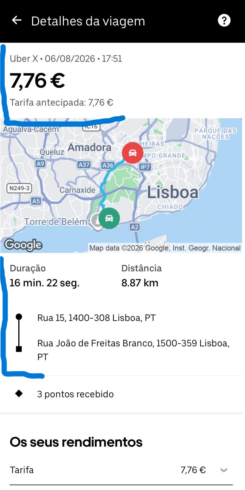
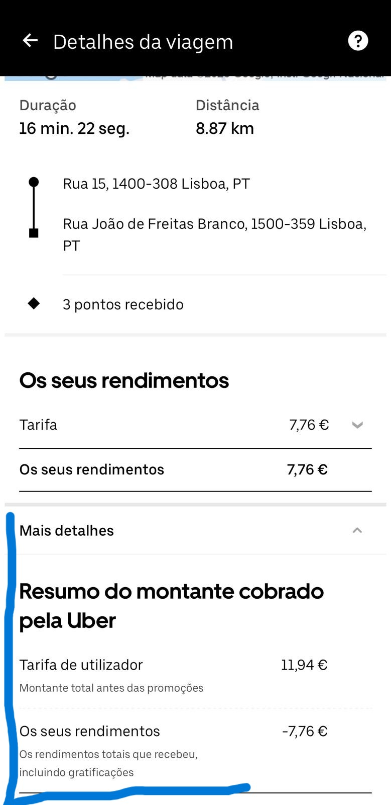
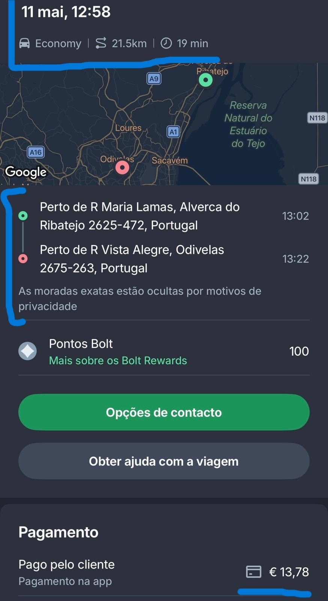
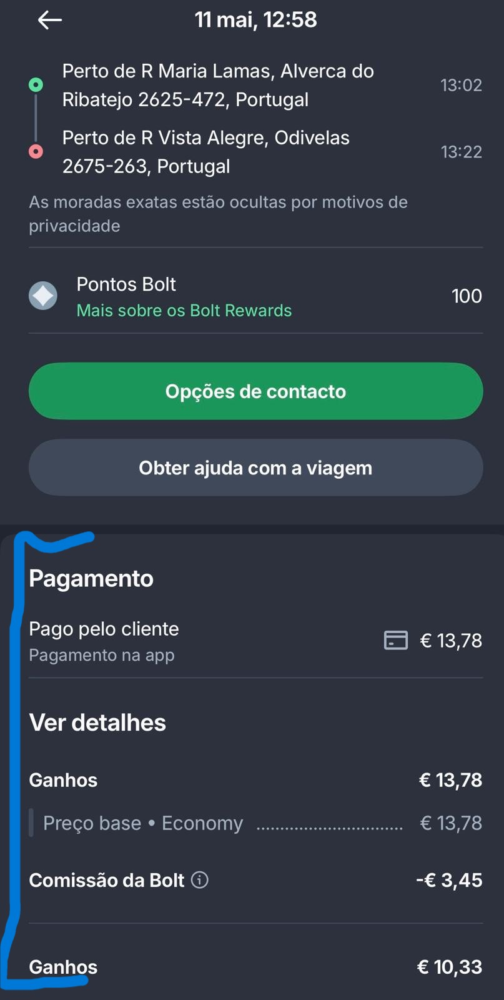
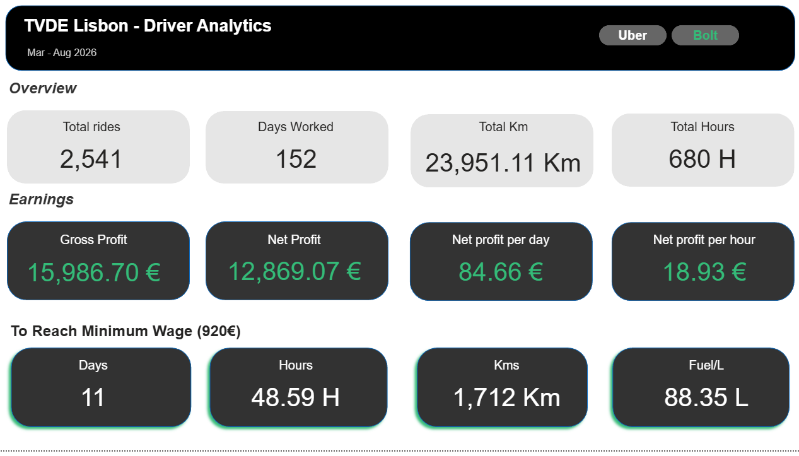
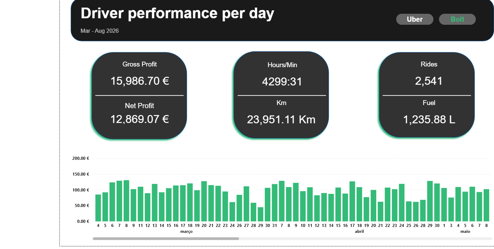
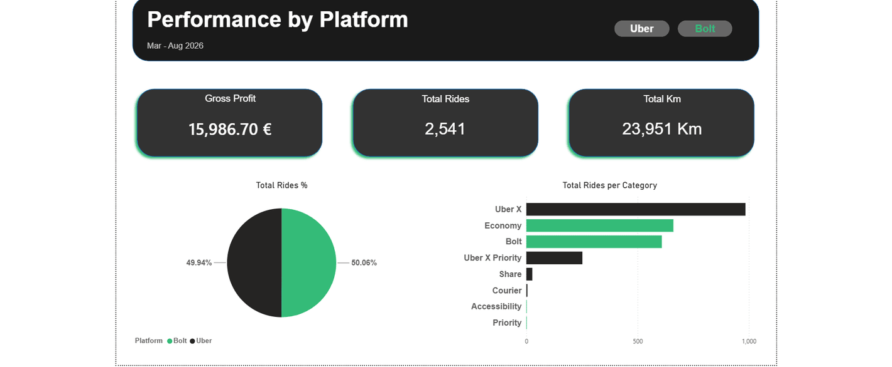
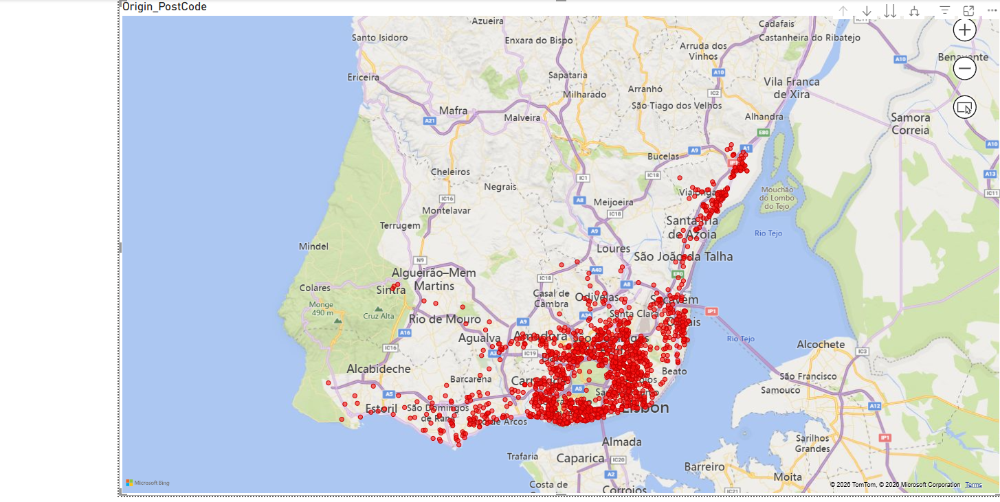

# Uber & Bolt Driver Analytics

A data analytics portfolio project built on **real ride-hailing data**
collected manually over 6 months (March–August 2026) as a working TVDE
driver in Lisbon, Portugal.

---

## Project Overview

This project analyses 2,541 rides across two platforms (Uber and Bolt)
to answer practical questions about driver earnings, ride efficiency,
and operational strategy. Unlike most portfolio projects that use
generic datasets, every data point here was recorded from real working
shifts.

The analysis is structured in four layers:
- **Excel** — manual data collection and storage
- **Power BI dashboard** — interactive KPIs and visual exploration
- **Python notebooks** — statistical analysis and hypothesis testing
- **SQL (SQLite)** — business queries replicating and extending the Python analysis

---

## Data Collection

### How the data was collected

All data was collected **manually** by the driver after each working
shift, directly from the Uber and Bolt driver apps. Each ride was
recorded individually into an Excel spreadsheet.

The data collection process for each ride:

1. **Open the driver app** (Uber or Bolt) after completing a ride
2. **Navigate to ride history** and open the individual ride details
3. **Record the following fields manually** into the Excel spreadsheet:
   - Platform, Category, Date, Start Time, End Time
   - Duration (minutes), Origin postal code, Destination postal code
   - Distance (km), Client fare (€), Driver earnings (€)
4. **Repeat for every ride** at the end of each shift

This manual process ensures full control over the data and allows
for immediate quality checking — any inconsistency (e.g. duration
not matching start/end times) was identified and corrected at the
point of entry.

### Data source examples

The screenshots below show real examples of the raw data as it
appears in the Uber and Bolt driver apps before being recorded
into the spreadsheet. All personal passenger information is
hidden by the platforms for privacy reasons.

<table>
<tr><td colspan="2"><b>Uber ride examples</b></td></tr>
<tr>
<td></td>
<td></td>
</tr>
</table>

<table>
<tr><td colspan="2"><b>Bolt ride examples</b></td></tr>
<tr>
<td></td>
<td></td>
</tr>
</table>

> *Screenshots from the Uber and Bolt driver apps are used for
> educational and portfolio purposes only, to illustrate the
> data collection methodology. All passenger data is automatically
> hidden by the platforms.*

### Why this data is reliable

- **No automated scraping** — every row was entered manually and verified at the point of collection
- **Exact values** — earnings and distances are taken directly from the official platform receipts, not estimated
- **Consistent format** — the same fields were recorded for every ride across the entire collection period
- **Platform receipts as source of truth** — the driver earnings shown in the app represent the final confirmed amount after any platform adjustments

**Collection period:** March 4 – August 2026
**Total rides analysed:** 2,541
**Working days:** 152
**Platforms:** Uber and Bolt

> This project was developed between March and August 2026.
> The analysis covers the full March–August 2026 period to capture
> both spring and summer mobility patterns in Lisbon.

---

## Data Schema

### Columns used in analysis

| Column | Description | Type |
|---|---|---|
| Ride_ID | Unique ride identifier | String |
| Platform | Uber or Bolt | String |
| Category | Service tier (UberX, Economy, Bolt, etc.) | String |
| Date | Ride date | Date |
| Start_Time | Ride start time | Time |
| End_Time | Ride end time | Time |
| Duration_Min | Ride duration in minutes | Float |
| Origin_PostCode | Postal code of ride origin | String |
| Dest_PostCode | Postal code of ride destination | String |
| Distance_Km | Ride distance in kilometres | Float |
| Client_Fare_EUR | Total amount paid by passenger | Float |
| Driver_Earnings_EUR | Net amount received by driver | Float |

### Columns excluded from analysis

| Column | Reason for exclusion |
|---|---|
| Platform_Fee_EUR | Focus is on driver perspective, not platform economics |
| Fee_Pct | Same reason as above |
| Portagem | Toll reimbursement — passes through, does not affect net earnings |
| Dinamica | Bolt-only surge data — not available on Uber, excluded for consistency |
| Tip | Inconsistent and cannot be relied upon as regular income |

---

## Operational Parameters

### Acceptance criteria

Rides are accepted under the following conditions:
- Minimum **0.50 €/km**
- Minimum **12 €/hour**
*Example: A €6 ride must be 12 km long and last a maximum of 30 minutes.*

### Working schedule

- Start: 12:30–13:00
- End: 21:30–22:00
- Rest days: variable (no fixed day off)
- having a few days with runs outside of that schedule for personal reasons

### Earnings targets

- Daily: **100€ gross**
- Weekly: **500€ net** (after fuel and fleet costs)

### Minimum wage reference

The reference minimum wage used is **920€ gross (2026)**. The gross
value was chosen over net because tax deductions vary by personal
situation (marital status, dependants).

---

## Cost Structure and Net Profit Calculation

### Fleet fee

The vehicle is operated under a fleet agreement. The fleet charges
a **fixed fee of 30€ per week**, regardless of the number of days
worked or rides completed. This is a common arrangement in the
Portuguese TVDE market — some fleets charge a fixed weekly amount,
others charge a percentage of earnings.

### Fuel cost — how it was calculated

**Step 1 — Measuring real fuel consumption:**

At the start of the project, a full-tank-to-full-tank fuel
consumption test was conducted over one working week:

| Measurement | Value |
|---|---|
| Odometer at start | 206,448 km |
| Odometer at end | 207,780 km |
| Distance driven | 1,332 km |
| Fuel used | 68.75 litres |
| Consumption result | 5.16 L/100km |

**Step 2 — Fuel price (period average):**

The vehicle is fuelled exclusively at PRIO stations.
Rather than using a single week's price (which fluctuates),
the fuel cost calculation uses the average diesel price
across the full collection period (March–August 2026):

Average diesel price at PRIO: **1.892 €/litre**

**Step 3 — Cost per km:**

Fuel cost per km = (5.16 / 100) x 1.892 = **0.0976 €/km**

**Step 4 — Proportional allocation:**

The vehicle is also used for personal trips outside working hours.
To avoid overestimating operational costs, fuel cost is applied
only to the km recorded in the dataset (ride km), not to total km driven:

Fuel cost = Total ride km x 0.0976 €/km

This ensures the net profit calculation reflects only costs
directly attributable to TVDE activity.

### Net profit cascade

For every aggregation in this project, net profit follows this calculation:

```
Gross Earnings    (sum of Driver_Earnings_EUR)
  - Fuel Cost     (Total_Km x 0.0976 €/km)
  - Fleet Cost    (Weeks_Worked x 30 €)
= Net Profit
```

Where Weeks_Worked is calculated as:

```
ROUND( (Last_Date - First_Date) / 7 )
```

This formula is identical in Python, SQL and Power BI —
verified by cross-validation.

---

## Business Questions Answered

### Driver economics
- How much does a TVDE driver actually earn per hour (net)?
- How many days does it take to reach the minimum wage (920€ gross)?
- What is the real cost of fuel per km driven?
- What is the net profit after all operational costs?

### Operational efficiency
- Does working more hours per day increase €/hour? (Q1)
- Do longer rides pay more per km? (Q2)
- Is there a statistically significant difference between Uber and Bolt? (Q3)
- Does more rides per day lead to higher €/hour? (Q4)

### Temporal patterns
- Is there a consistent weekly pattern? (Q5)
- Which hour of the day generates the most profit? (Q6)
- Is there a trend over time in €/hour earnings? (Q7)
- Do weekends behave differently from weekdays? (Q8)

### Ride profile
- What is the real distribution of distances and fares? (Q9)
- Is there an optimal ride distance? (Q10)
- What is the profile of the most frequent ride? (Q11)

### Acceptance criteria analysis
- What % of rides meet the acceptance criteria? (Q12)
- At what time do more rides meet the acceptance criteria? (Q13)
- How close are results to the daily and weekly targets? (Q14)
- Is the working schedule (12:30–22:00) well dimensioned? (Q15)
- Does more km per day lead to higher net profit? (Q16)

### Geographic mobility
- Which postal code areas generate the most rides?
- What are the most frequent origin to destination flows?
- Which zones generate the highest earnings per ride?
- How do geographic hotspots change by time period and day type?

---

## Methodology Notes

### Why median over mean?

All ride distributions are right-skewed — a small number of long,
high-value rides pull the mean upward. The median is used as the
primary central tendency measure throughout this analysis.

### Statistical tests used

- **Pearson correlation + linear regression** — for continuous variable relationships (hours vs €/hour, distance vs €/km)
- **Mann-Whitney U test** — for platform and day-type comparisons, chosen over t-test because ride earnings do not follow a normal distribution

### Outlier treatment

Outliers were identified using the IQR method (1.5x fence).
All flagged outliers were inspected individually and retained —
they represent genuine long-distance rides (max 54 km), not data entry errors.

### Weeks worked calculation

Fleet cost is calculated using the difference between the first
and last recorded date, divided by 7 and rounded. This matches
the Power BI DAX DATEDIFF calculation exactly, ensuring
consistency across all tools.

### Cross-validation

Net profit after all costs was validated across all three tools:

| Tool | Net Profit |
|---|---|
| Power BI | 12,869.07 € |
| Python | 12,869.07 € |
| SQL | 12,869.07 € |

All three return identical results, confirming consistency across
the full analysis pipeline.

---

## Key Findings

*(Full March–August 2026 dataset — 2,541 rides across 152 working days)*

- **Net profit per hour:** 18.93 €
- **Days to reach minimum wage:** 11 days (920€ gross)
- **84.3% of rides meet both acceptance criteria** — strategy is working
- **Friday is the best day** (116€ avg daily earnings, 27.2 €/h)
- **16:00–18:00 is the golden window** — 91–94% acceptance rate
- **Bolt outperforms Uber** in acceptance rate (88.2% vs 80.6%) — statistically significant (p = 0.0019)
- **More rides per day = higher €/hour** (r = 0.422, p < 0.001)
- **Short rides (0–3 km) are most efficient** (2.22 €/km, 42.9 €/h) but represent only 8.5% of rides
- **The 5–12 km bracket is the core market** (53.6% of all rides)
- **Postal codes 1300 and 1500** are the top origin and destination zones, accounting for ~21% of all ride starts

---

## Power BI Dashboard Preview

Static previews of the 4-page interactive dashboard, generated from the
full March–August 2026 dataset.

> **Note:** These are static screenshots. To interact with the dashboard
> (filter by platform, drill into categories, explore the map), open
> `powerbi/tvde_dashboard.pbix` in Power BI Desktop.

<table>
<tr>
<td width="50%">

<br/><sub><b>Overview</b> — KPIs, earnings and minimum wage tracker</sub>
</td>
<td width="50%">

<br/><sub><b>Driver Performance</b> — daily earnings trend over time</sub>
</td>
</tr>
<tr>
<td width="50%">

<br/><sub><b>Platforms</b> — Uber vs Bolt volume and category breakdown</sub>
</td>
<td width="50%">

<br/><sub><b>Map</b> — geographic distribution of ride origins across Lisbon</sub>
</td>
</tr>
</table>

---

## Project Structure

```
tvde-lisboa-analysis/
├── data/
│   ├── raw/
│   │   └── TVDE_In.xlsx
│   └── processed/
│       └── tvde_rides_clean.csv
├── notebooks/
│   ├── 01_data_cleaning_and_analysis.ipynb
│   ├── 02_sql_analysis.ipynb
│   └── 03_mobility_analysis.ipynb
├── powerbi/
│   └── tvde_dashboard.pbix
├── images/
│   ├── data_collection_uber_example_1.jpeg
│   ├── data_collection_uber_example_2.jpeg
│   ├── data_collection_bolt_example_1.jpeg
│   ├── data_collection_bolt_example_2.jpeg
│   ├── dashboard_overview.png
│   ├── dashboard_driver_performance.png
│   ├── dashboard_platforms.png
│   ├── dashboard_map.png
│   └── *.png ← charts generated by the notebooks
├── README.md
└── requirements.txt
```

---

## How to Run

```
git clone https://github.com/gabriel-souza-data/tvde-lisboa-analysis
cd tvde-lisboa-analysis
pip install -r requirements.txt
jupyter lab
```

Run notebooks in order:
1. notebooks/01_data_cleaning_and_analysis.ipynb
2. notebooks/02_sql_analysis.ipynb
3. notebooks/03_mobility_analysis.ipynb

---

## Tools Used

| Tool | Purpose |
|---|---|
| Excel | Manual data collection and storage |
| Python + pandas | Data cleaning and statistical analysis |
| matplotlib + seaborn | Data visualisation |
| scipy | Statistical testing |
| SQLite (via Python) | SQL query analysis |
| folium | Geographic visualisation library |
| Power BI | Interactive dashboard |
| Claude (Anthropic) | AI-assisted development — code review, debugging and documentation |
| GitHub | Version control and portfolio hosting |

---

## Author

**Gabriel Souza** — TVDE driver and data analyst Lisbon, Portugal · 2026
LinkedIn: https://www.linkedin.com/in/gabriel-souza-5bb6123a8/ GitHub: https://github.com/gabriel-souza-data
